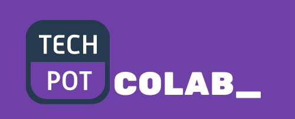

<p align="center">

</p>

<p align="center">

 <a href="https://github.com/adarshaacharya/CodeTreats/blob/master/LICENSE" target="_blank">

</a>

</p>

<h4 align="center">
In-browser collaborative code editor.
</h4>


## ⭐ Features

-   In-browser IDE with VS Code like text editor having features like auto-completion, code-formatting
-   Supports for 9 languages
-   Realtime Collaboration
-   Multi-files

> ⚠️ *Website isn't mobile friendly.*

## 📺 Prerequisites

Before running app locally make sure that you have the following set up:

-   [The Techpot-colab API](https://github.com/PedroMiotti/colab-editor-api)
-   [Judge0 API](https://github.com/judge0/judge0#get-started) - You can start with the free plan on RapidAPI or host it yourself. I recommend you hosted it yourself, its pretty easy to get started.

## 🚀 Local Development

### Step 1: Clone the repo

```bash
https://github.com/PedroMiotti/colab-editor
```

## Step 2: Install dependencies

```bash

# Install dependencies
$ npm install
```

### Step 3: Configuration

1. Create `.env` file in project root dir

    ```bash
    $ touch .env
    ```

2. Copy everything from `.env.example` as paste it in `.env`

3. Insert the Judge0 URL and the techpot-colab-API URL.
4. The socket URL is the as the techpot-colab-API URL.


## 📝 License

This project is [MIT](https://github.com/adarshaacharya/CodeTreats/blob/master/LICENSE) licensed.